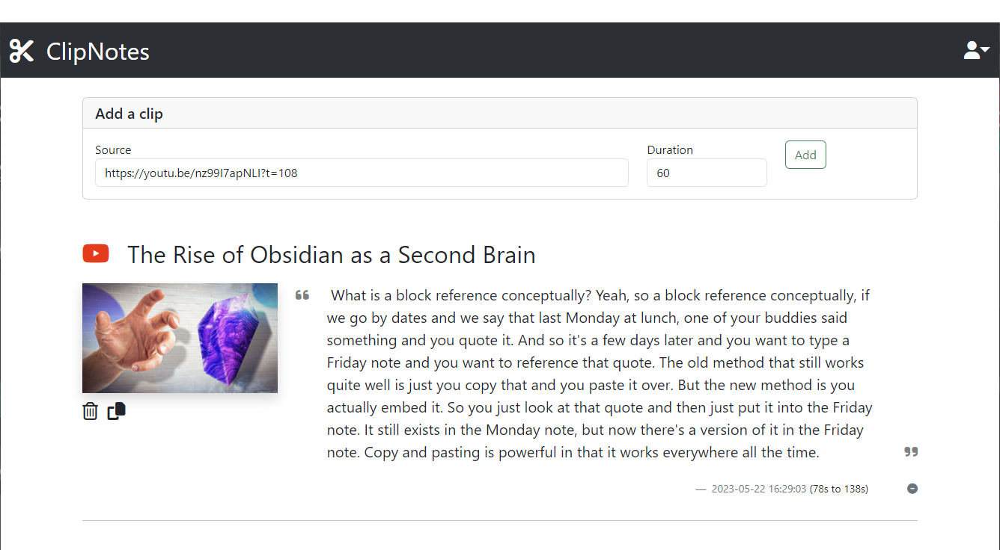

# clipnotes
A web app for turning podcasts and streaming video into markdown for note-taking

## Purpose
I started this project because I like to take notes in [Obsidian](https://obsidian.md/). While there are plenty of workflows for syncing text-based snippets to your notebooks from sources like Kindle, there was no seemless way to do the same thing for podcasts and streaming video.

Clipnotes consumes an audio source and a timestamp and turns that into text for you to include in your notes. While it has a front-end for browsing and editing your sources, its primary purpose is to provide an API so that other apps can submit clips and retrieve markdown in the background automatically. This was developed side-by-side with an Obsidian plugin that does exactly that.

## Example Usage
The simplest way to interact with ClipNotes is through the web app. If you submit a time-stamped YouTube link like `https://youtu.be/nz99I7apNLI?t=108`, the following note would be added:



Similarly, `https://pca.st/pyg37ygq#t=158` would create a snippet for the linked podcast at the 158-second mark.

## Setup
The easiest way to run a ClipNotes server is through Docker. Being a [flask](https://flask.palletsprojects.com/en/2.3.x/#) application, you'll need to supply a secret key at runtime. I'd recommend using something like python's [secrets module](https://docs.python.org/3/library/secrets.html) to generate one:

```bash
 python -c 'import secrets; print(secrets.token_hex())'
```
After that, you can run the docker container and supply this key:

```
docker run -d -e YOUR_SECRET clipnotes
```
By default, [waitress](https://flask.palletsprojects.com/en/2.3.x/deploying/waitress/) will serve the site on port 8080.
## API
For all of the endpoints listed below, you'll need to include the header `X-Api-Key` with a valid key generated by ClipNotes for your user account.

<details>
 <summary><code>GET</code> <code><b>/api/sources</b></code> <code>(gets all sources and their snippets)</code></summary>

##### Parameters

> None

##### Responses

> | http code     | content-type                      | response                                                            |
> |---------------|-----------------------------------|---------------------------------------------------------------------|
> | `200`         | `application/json`                | `All the user's sources and snippets (example below)` | 

##### Example cURL

> ```javascript
>  curl -X GET -H "X-Api-Key: YOUR_KEY" http://localhost:8080/api/sources
> ```

##### Example response:
```json
[
    {
        "id": 1,
        "provider": "youtube",
        "snippets": [
            {
                "created_at": "Mon, 22 May 2023 16:29:03 GMT",
                "duration": 60,
                "id": 1,
                "source_id": 1,
                "text": " What is a block reference conceptually? Yeah, so a block reference conceptually, if we go by dates and we say that last Monday at lunch, one of your buddies said something and you quote it. And so it's a few days later and you want to type a Friday note and you want to reference that quote. The old method that still works quite well is just you copy that and you paste it over. But the new method is you actually embed it. So you just look at that quote and then just put it into the Friday note. It still exists in the Monday note, but now there's a version of it in the Friday note. Copy and pasting is powerful in that it works everywhere all the time.",
                "time": 108,
                "user_id": 1
            }
        ],
        "thumb_url": "https://i.ytimg.com/vi/nz99I7apNLI/maxresdefault.jpg",
        "title": "The Rise of Obsidian as a Second Brain",
        "url": "https://youtu.be/nz99I7apNLI"
    }
]
```
</details>

<details>
 <summary><code>GET</code> <code><b>/api/source/{source_id}/markdown</b></code> <code>(gets markdown for all snippets in the source)</code></summary>

##### Parameters

> | name      |  type     | data type               | description                                                           |
> |-----------|-----------|-------------------------|-----------------------------------------------------------------------|
> | source_id |  required | int                     |                                                                       |
> | latest    |  optional | bool                    | if true, will only return markdown for the notes since last sync      |
> | exclusions | optional | string[]                | possible values are 'title' and 'thumbnail'                           |

##### Responses

> | http code     | content-type                      | response                                                            |
> |---------------|-----------------------------------|---------------------------------------------------------------------|
> | `200`         | `text/plain`                | `Markdown-formated text for all snippets under the source` | 

##### Example cURL

> ```javascript
>  curl -X GET -H "X-Api-Key: YOUR_KEY" http://localhost:8080/api/source/1/markdown
> ```

##### Example response:
```
# The Rise of Obsidian as a Second Brain

[The Rise of Obsidian as a Second Brain](https://youtu.be/nz99I7apNLI)


What is a block reference conceptually? Yeah, so a block reference conceptually, if we go by dates and we say that last
Monday at lunch, one of your buddies said something and you quote it. And so it's a few days later and you want to type
a Friday note and you want to reference that quote. The old method that still works quite well is just you copy that and
you paste it over. But the new method is you actually embed it. So you just look at that quote and then just put it into
the Friday note. It still exists in the Monday note, but now there's a version of it in the Friday note. Copy and
pasting is powerful in that it works everywhere all the time. [108](https://youtu.be/nz99I7apNLI?t=108)
```
</details>

<details>
 <summary><code>POST</code> <code><b>/api/source/{source_id}/sync</b></code> <code>(updates the last-synced timestamp)</code></summary>

##### Parameters

> | name      |  type     | data type               | description                                                           |
> |-----------|-----------|-------------------------|-----------------------------------------------------------------------|
> | source_id |  required | int                     |                                                                       |


##### Responses

> | http code     | content-type                      | response                                                            |
> |---------------|-----------------------------------|---------------------------------------------------------------------|
> | `200`         | `application/json`                | `Updated SyncRecord`                                                |

##### Example cURL

> ```javascript
>  curl -X POST -H "X-Api-Key: YOUR_KEY" http://localhost:8080/api/source/1/sync
> ```

##### Example Response
```json
{
    "id": 1,
    "source_id": 1,
    "synced_at": "Mon, 22 May 2023 17:39:17 GMT",
    "user_id": 1
}
```
</details>

<details>
 <summary><code>POST</code> <code><b>/api/enqueue</b></code> <code>(adds a source to the processing queue)</code></summary>

##### Parameters

> | name      |  type     | data type               | description                                                           |
> |-----------|-----------|-------------------------|-----------------------------------------------------------------------|
> | url       |  required | string                  |                                                                       |
> | time      |  optional | int                     | the timestamp (in seconds) for the snippet                            |
> | duration  |  optional | int                     | the duration of the snippet (in seconds)                              |


##### Responses

> | http code     | content-type                      | response                                                            |
> |---------------|-----------------------------------|---------------------------------------------------------------------|
> | `200`         | `text/plain`                      | `Success`                                                           |

##### Example cURL

> ```javascript
> curl -X POST -H "X-Api-Key: YOUR_KEY" "http://localhost:5000/api/enqueue?url=https://youtu.be/T6hmdrsLQj8&time=711&duration=60"
> ```

##### Example Response
```json
{
    "id": 1,
    "source_id": 1,
    "synced_at": "Mon, 22 May 2023 17:39:17 GMT",
    "user_id": 1
}
```
</details>